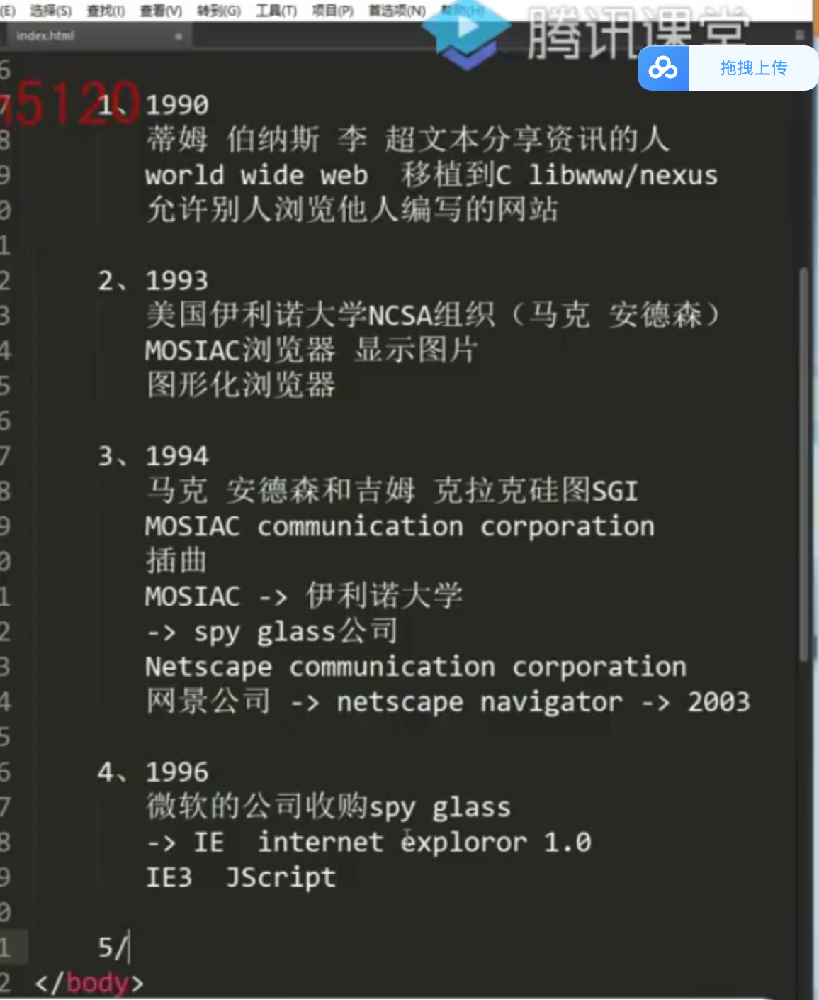

## 浏览器
shell和内核组成

主流浏览器：

Google Chrome：webkt/blink

IE: trident

firefox : gecko

safari:webkt

opera: presto

内核：渲染(rendering)引擎/JS引擎

访问网址：先构建 dom树（html结构）；新开一个线程解析css,css树；后面形成一个渲染树
## CSS
cascading style sheet 层叠样式表

外部样式：

格式：
    选择器{
        属性名： 属性值；
    }

内联样式：

内联样式 > 内部样式表 > 外部样式表(单独文件夹)

- 选择器：
    - id(唯一)；#box{}
    - class(类选择器);.box{}
    - 标签选择权;标签名{}

